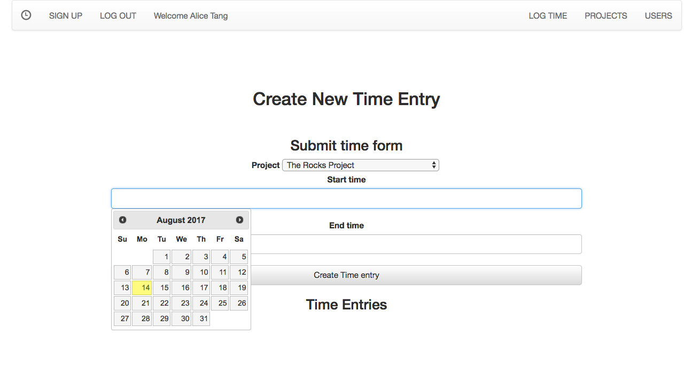

# Project Time Tracker - General Assembly Project 1

## Overview
Project-time-tracker is a full stack web application where employees can keep track of time spent on each project.

Here is the live site [check it out ](https://project-time-tracker.herokuapp.com/)

## Built with
HTML5, CSS3, JavaScript, jQuery, Ruby on Rails, BootStrap framework

##Author
Alice Tang
